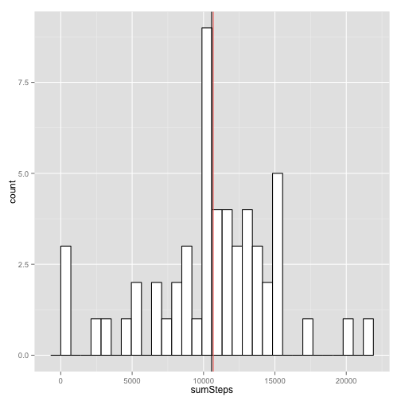
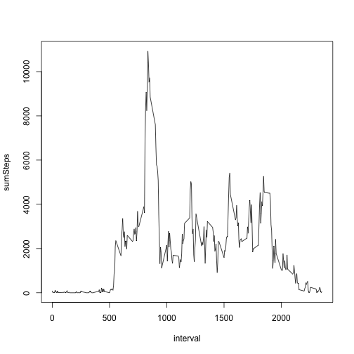
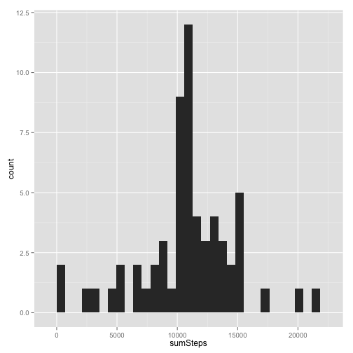
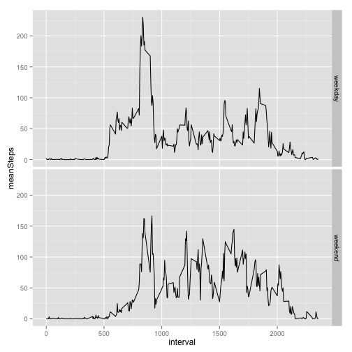

# Reproducible Research: Peer Assessment 1


## Loading and preprocessing the data

```r
  require(plyr)
```

```
## Loading required package: plyr
```

```r
  require(ggplot2)
```

```
## Loading required package: ggplot2
```

```r
  setwd("~/datasciencecoursera/RepData_PeerAssessment1")
  acts<-read.csv("activity.csv")
```
## What is the mean total number of steps per day?

```r
##  
##
## Summarize by Date
##
#
  stepsPerDay<-ddply(acts,"date",summarize,sumSteps=sum(steps,na.rm=TRUE))
##
## Calculate the mean, ignoring the NA
##
  stepMean<-mean(stepsPerDay$sumSteps[!is.na(stepsPerDay$sumSteps)] )
  cat("The mean total number of steps taken per day is", stepMean)
```

```
## The mean total number of steps taken per day is 9354
```


```r
## Plot the histogram oftotal  steps per day
  ggplot(stepsPerDay, aes(  x=sumSteps)) + geom_histogram()
```

```
## stat_bin: binwidth defaulted to range/30. Use 'binwidth = x' to adjust this.
```

 
## What is the average daily activity pattern?

```r
##Calculate and report the mean and median total number of steps taken per day
  meanStepsPerDay<-mean(stepsPerDay$sumSteps[!is.na(stepsPerDay$sumSteps)])
  medianStepsPerDay<-median(stepsPerDay$sumSteps[!is.na(stepsPerDay$sumSteps)])
  cat("The mean total steps per day is",meanStepsPerDay, "and the median total steps per day is",medianStepsPerDay)
```

```
## The mean total steps per day is 9354 and the median total steps per day is 10395
```
###Time series plot of steps per interval

```r
##
##Get the complete cases for the summary with ddply and the plot
##
  #facts<-acts[complete.cases(acts),]
  sumIntervals<-ddply( acts,"interval",summarize,sumSteps=sum(steps,na.rm=TRUE))
  plot(sumIntervals,t="l")
```

 


```r
##
##Find the interval with the the highest average number of steps
## 
  meanIntervals<-ddply(acts,"interval",summarize,meanSteps=mean(steps,na.rm=TRUE))
  maxStepInterval<-meanIntervals$interval[which(meanIntervals$meanSteps==max(meanIntervals$meanSteps))]
  cat("The interval beginning at",maxStepInterval,"has the highest average number of steps." )
```

```
## The interval beginning at 835 has the highest average number of steps.
```

## Input missing values 
## Strategy: Use the Mean value per interval across all days as the replacement for NA values

```r
## find the number of rows with missing values
  notThere<-!complete.cases(acts)
  missing<-sum(notThere==TRUE)
  cat(missing,"items have missing data")
```

```
## 2304 items have missing data
```
replace missing data with mean for the interval

```r
##
## Copy the activities dataframe
##
fixedActs<-acts
##
## Reuse the meanIntervals vector calculated previously
## and use the interval value as the row name so we can use which to find the interval needed
##
  rownames(meanIntervals)<-meanIntervals[,1]
##
## loop through the copied vector replacing the NAs with mean values
##
  n<-length(rownames(fixedActs))
    for (i in 1:n)
    {
      if (is.na(fixedActs[i,1]))
      {
        fixedActs[i,1]<-meanIntervals[as.character(fixedActs[i,3]),2]
      }
    }
fstepsPerDay<-ddply(fixedActs,"date",summarize,sumSteps=sum(steps))
```

```r
## Plot the filled  histogram
  ggplot(fstepsPerDay, aes(  x=sumSteps)) + geom_histogram()
```

```
## stat_bin: binwidth defaulted to range/30. Use 'binwidth = x' to adjust this.
```

 

```r
  fstepMean<-mean(fstepsPerDay$sumSteps)
  fstepMedian<-median(fstepsPerDay$sumSteps)
  meanDiff<-stepMean-fstepMean
  cat("The mean steps per day changed by",meanDiff, "steps")
```

```
## The mean steps per day changed by -1412 steps
```

```r
  medianDiff<-fstepMedian-medianStepsPerDay
  cat("The median steps per day changed by",medianDiff, "steps")
```

```
## The median steps per day changed by 371.2 steps
```


## Are there differences in activity patterns between weekdays and weekends?
Create a factor for weekday versus weekend

```r
  fixedActs$dayType="weekday"
  days<-weekdays(strptime(fixedActs$date,format="%Y-%m-%d"))
  sats<-days=="Saturday"
  suns<-days=="Sunday"
  fixedActs$dayType[suns]<-"weekend"
  fixedActs$dayType[sats]<-"weekend"
  table(fixedActs$dayType)
```

```
## 
## weekday weekend 
##   12960    4608
```
Summarize the data and plot it

```r
  wf<-ddply(fixedActs,.(interval,dayType),summarize,meanSteps=mean(steps))
  d<-ggplot(wf,aes(x=interval,y=meanSteps),geom="line",facets=dayType)+facet_grid(dayType ~.)
  d+geom_line()
```

 
